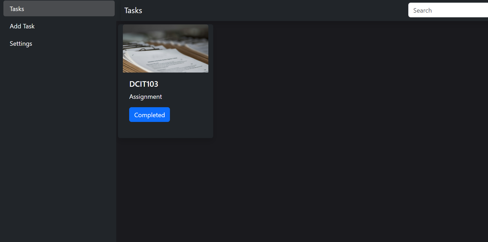
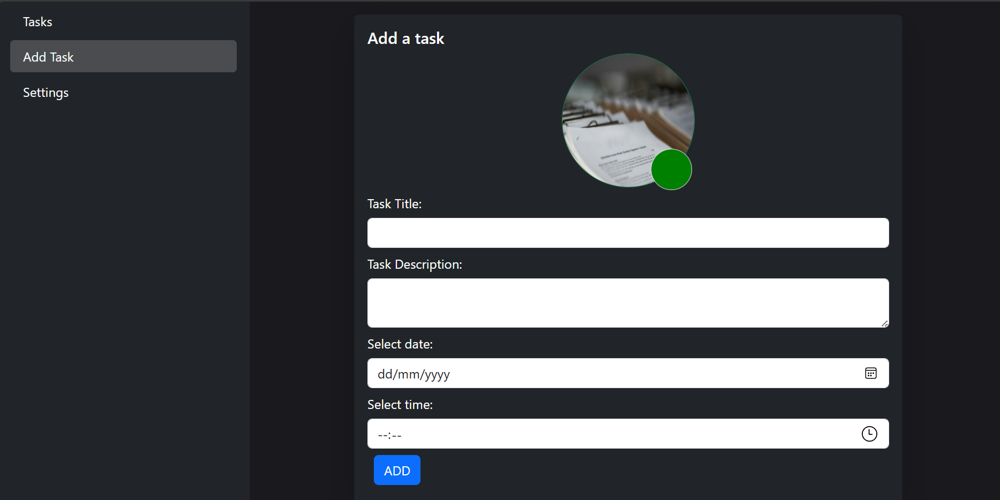
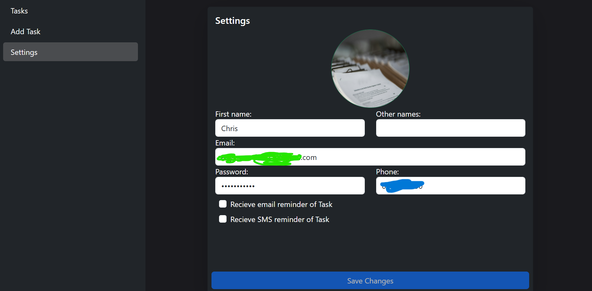

# TaskMgr (Task Management Web App)

A **React** web application that helps users manage their tasks efficiently. The app sends email and sms reminder when a task is **3 days** away from its due date.

## Features

- Create, update, and delete tasks
- Set due dates for tasks
- Automatic email and sms reminders for tasks due in 3 days
- User-friendly interface for managing tasks
- Auth0 (signin with google, outlook etc)

**Languages**

- Python

- Typescript

## Technologies Used

- **React, Bootstrap** – For building the frontend
- **FastAPI** – For backend API
- **SQLite3** – For database storage
- **SMTP (Python)** – For sending email reminders

### Prerequisites

Ensure you have the following installed:

- **Node.js**
- **npm**
- **SQLite3**
- Python
- FastAPI(Python module)

# Some Screenshots from App

**Home Page showing all tasks of the user. User is also allowed to search through tasks**



**This allows the user add tasks. with needed details**



**Settings Page. Allowing user to change details of account. Users can also opt in and out of email and sms notifications (😂I dont like spam 😜)**



### Steps

1. Clone the repository:
   
   ```sh
   git clone https://github.com/chrisgithub2020/TaskMgr.git
   cd taskmgr
   ```

2. Install dependencies:
   
   ```sh
   npm install
   ```

3. Start the development server:
   
   ```sh
   npm start
   
   or
   
   npm run dev
   ```

4. **Run the backend (if separate):**
   
   4.i *Install required packages from requirement.txt*
   
   ```shell
   ##create virtual environment if you want(i suggest you do)
   python -m venv "path to venv"
   
   # step2
   "path to venv"\Scripts\activate
   
   #step3
   pip install -r /path/to/requirements.txt
   ```
   
   ```sh
   ## navigate to server directory in the repo
   cd server ## on windows
   ```

## start server

```sh
   uvicorn main:app --reload
```

## Usage

1. Open the app in your browser.
2. Add tasks with due dates.
3. Receive email and sms reminders when tasks are 3 days from their deadline.

## Configuration

- **Email Service:** Configure SMTP settings in the `.env` file:
  
  create a `.env` file and fill it with theres variables

```env
  PROVIDER=smtp.yourmailprovider.com
  PORT=587
  EMAIL=your-email@example.com
  PASSWORD=your-email-password
  
  DB_NAME="PATH/TO/DATABASE"
```

## Contribution

Contributions are welcome! Follow these steps:

1. Fork the repository
2. Create a feature branch: `git checkout -b feature-name`
3. Commit changes: `git commit -m 'Add new feature'`
4. Push to the branch: `git push origin feature-name`
5. Open a pull request

## License

This project is licensed under the **MIT License**.

---

### Contact

For any inquiries, feel free to reach out:
📧 **[agyemanchris0@gmail.com](mailto:agyemanchris0@gmail.com)**

🚀 Happy Coding!
